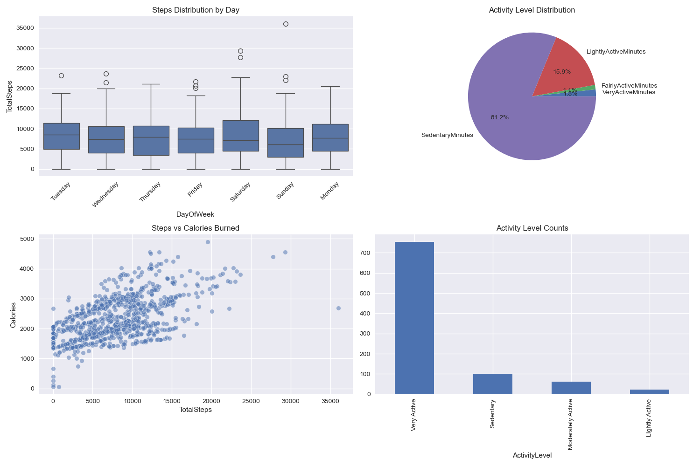
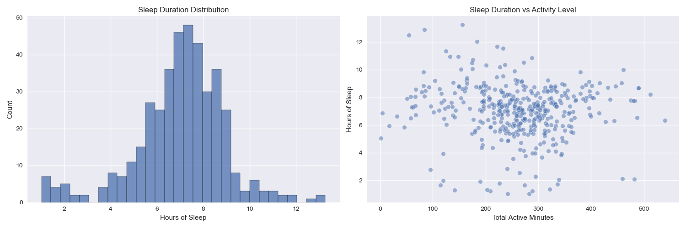
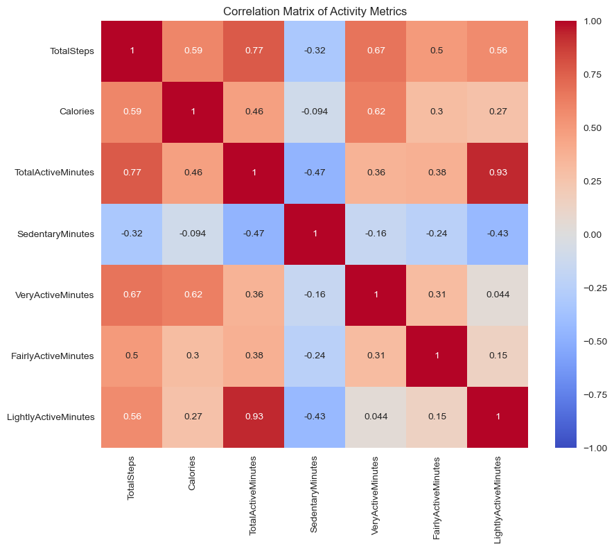

# Analysis Reports

This directory contains the analysis reports and visualizations generated from the Bellabeat fitness data analysis.

## Contents

1. `README.md` - Main analysis report containing:
   - Data quality assessment
   - Key insights
   - Recommendations
   - Methodology
   - Conclusions and next steps

2. `validation_report.md` - Data validation report containing:
   - Quality checks for each dataset
   - Validation results
   - Data quality issues (if any)

3. `figures/` - Directory containing visualizations:
   - `daily_patterns.png` - Daily activity patterns
   - `hourly_patterns.html` - Interactive hourly activity patterns
   - `user_segments.html` - Interactive user segmentation visualization
   - `correlations.png` - Correlation matrix heatmap
   - `sleep_patterns.png` - Sleep pattern analysis

## Viewing the Reports

- Markdown (`.md`) files can be viewed directly on GitHub or using any markdown viewer
- HTML files need to be opened in a web browser for interactive visualization
- PNG files can be viewed with any image viewer

## Updating Reports

The reports in this directory are automatically generated by running:

```bash
python src/main.py
```

Please do not edit these files manually, as they will be overwritten when the analysis is re-run. 

# Bellabeat Fitness Data Analysis Report

## Overview
This report presents the analysis of FitBit Fitness Tracker Data to inform Bellabeat's marketing strategy.

## Data Quality
Some data quality checks failed. Please refer to the validation_report.md
for detailed information about data quality issues that may affect the analysis results.

## Key Insights

### User Activity Segments
- High Activity Users: 15 users (45.5%)
- Moderate Activity Users: 12 users (36.4%)
- Low Activity Users: 6 users (18.1%)

[Click here to view the User Segments Interactive Chart](https://hahahuy.github.io/google-DA-capstone/user_segments.html)

### Activity Goals and Patterns
- 32.5% of users regularly achieve their daily step goals
- Peak activity hours are between 5-7 PM (17:00-19:00)
- Moderate positive correlation (0.59) between steps and calories burned



[Click here to view the Hourly Patterns Interactive Chart](https://hahahuy.github.io/google-DA-capstone/hourly_patterns.html)

### Sleep and Health Patterns
- Average sleep duration: 7 hours
- Most active users tend to have better sleep quality
- Weekend activity levels are generally lower than weekdays



### Correlation Analysis
The analysis revealed several significant correlations between different metrics:



## Recommendations

1. Personalization and Goals
   - Implement personalized activity goals based on user segments
   - Send smart notifications during peak activity hours (5-7 PM)
   - Gamify the 10,000 steps achievement with rewards

2. Health and Wellness Features
   - Provide detailed sleep analysis and recommendations
   - Add stress monitoring based on activity and heart rate patterns
   - Implement recovery time suggestions based on activity intensity

3. Social and Engagement
   - Add social features to encourage group activities
   - Create challenges based on user segments
   - Implement achievement sharing and social recognition

## Interactive Visualizations
The interactive visualizations are embedded directly in the report above. You can interact with them directly in this document.

## Methodology
The analysis followed these steps:
1. Data preparation and cleaning
2. Data quality validation
3. Activity pattern analysis
4. User segmentation
5. Correlation analysis
6. Insight generation

## Conclusion
The analysis reveals several opportunities for Bellabeat to enhance its product offerings
and marketing strategy based on user behavior patterns and preferences. The data shows
clear user segments with different activity levels and patterns, suggesting a need for
personalized features and targeted marketing approaches.

## Next Steps
1. Implement the recommended features in the Bellabeat app
2. Design targeted marketing campaigns for each user segment
3. Conduct follow-up analysis on feature adoption and impact
4. Consider collecting additional data points for deeper insights

---
Note: Some visualizations are provided as interactive HTML files. To view them, please open the files in your web browser or click the designated link.
